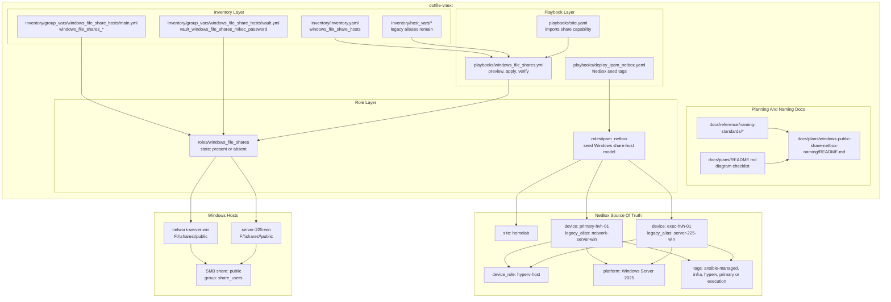
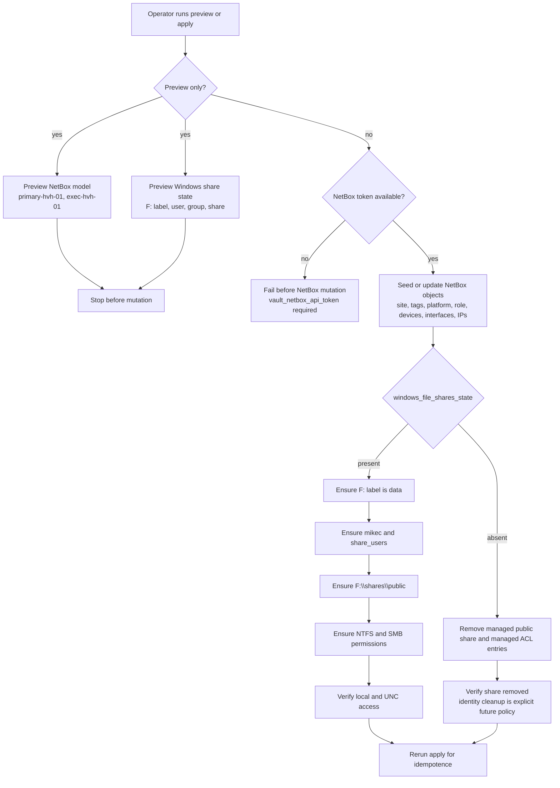
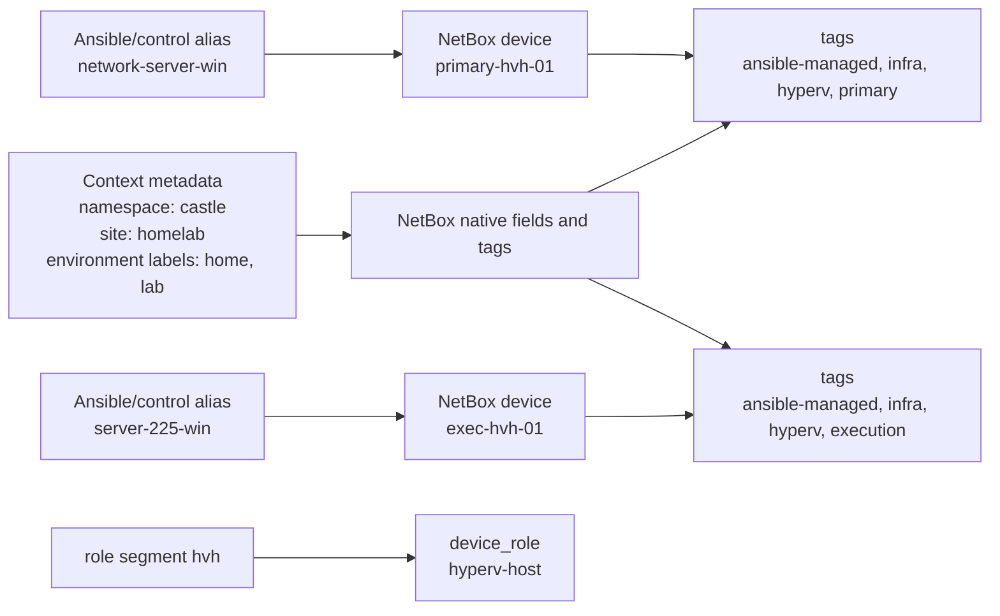

# Windows Public Share Capability Plan With NetBox Naming And Required Diagrams

## Summary

- Add a reusable Windows public-share capability for `server-225-win` and `network-server-win`.
- Replace the NetBox-facing `network-server-win` alias concept with `primary-hvh-01`.
- Use short NetBox names and push rich context into NetBox native fields, tags, and context metadata.
- Fix the planning gap by adding a plan-authoring checklist under `docs/plans/`.

## Architecture/Structure Diagram



## Capability Routing Diagram



## Naming/Modeling Diagram



## Key Changes Implemented

- NetBox naming keeps `network-server-win` and `server-225-win` as Ansible/control aliases.
- NetBox device names are `primary-hvh-01` and `exec-hvh-01`.
- `castle` remains namespace/context, not tenant.
- `homelab` remains NetBox site; `home` and `lab` remain context labels unless later promoted.
- `windows_file_shares` owns the Windows SMB capability with `windows_file_shares_state: present|absent`.
- The managed Windows share is `F:\shares\public` exposed as `public`.
- Access is credentialed: local group `share_users`, user `mikec`, NTFS `Modify`, SMB `Change`.
- Anonymous access and `Everyone` share grants are intentionally omitted.
- `docs/plans/README.md` now requires stored plans to include required diagram sections or explicit `N/A` reasons.

## Apply / Verify / Undo

Apply:

```bash
ansible-playbook playbooks/windows_file_shares.yml -i inventory/inventory.yaml
ansible-playbook playbooks/deploy_ipam_netbox.yaml -i inventory/inventory.yaml --tags ipam_netbox_seed_windows_share_hosts_model
```

Verify:

```bash
ansible-playbook playbooks/windows_file_shares.yml -i inventory/inventory.yaml --tags windows_file_shares_verify
ansible-playbook playbooks/deploy_ipam_netbox.yaml -i inventory/inventory.yaml --tags ipam_netbox_seed_windows_share_hosts_model_preview
```

Undo:

```bash
ansible-playbook playbooks/windows_file_shares.yml -i inventory/inventory.yaml -e windows_file_shares_state=absent
```

NetBox cleanup remains explicit/manual unless an `absent` source-of-truth seed path is added later.

Change class: idempotent Windows configuration plus NetBox source-of-truth modeling.

## Validation Plan

- `ansible-playbook playbooks/windows_file_shares.yml -i inventory/inventory.yaml --syntax-check`
- `ansible-lint playbooks/windows_file_shares.yml`
- `ansible-playbook playbooks/deploy_ipam_netbox.yaml -i inventory/inventory.yaml --syntax-check`
- Preview `windows_file_share_hosts` before applying share mutations.
- Preview NetBox naming model before applying NetBox mutations.
- Apply and verify that:
  - `Get-Volume -DriveLetter F` returns label `data`
  - `F:\shares\public` exists
  - `mikec` exists and belongs to `share_users`
  - SMB share `public` exists with `share_users` Change access
  - `\\localhost\public` works with the vaulted credential
  - second apply is idempotent
