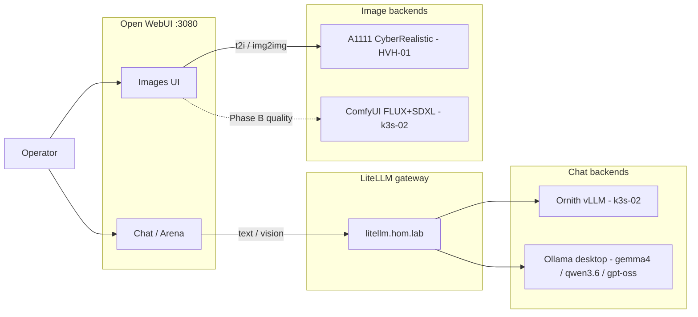

# Local AI chat + image stack

Concise plan of the Open WebUI / LiteLLM / Ollama / vLLM / Automatic1111 / ComfyUI layout.

## Goal

- Chat in Open WebUI via LiteLLM (`gemma4-12b`, `qwen3.6-27b`, `gpt-oss-20b`,
  `studio-coach`, Ornith, code lanes, `smart-router`).
- Open WebUI **Images** t2i → Automatic1111 (CyberRealistic SD1.5 on GTX 1060).
- Quality stills / FLUX / SDXL → ComfyUI on k3s-02 RTX 5090 (Phase B time-share).
- Keep single-GPU roles separate on **steady-state**: k3s-02 = Ornith (vLLM);
  desktop = Ollama chat; HVH-01 = A1111.
- Optional **Phase B**: time-share the k3s-02 5090 with ComfyUI (pauses Ornith).
  Flip guide: [k3s-02-gpu-timeshare-phase-b.md](k3s-02-gpu-timeshare-phase-b.md).

## Surfaces

| Surface | Where | Role |
| --- | --- | --- |
| Open WebUI | `hom-lab-ctl-dkr-02` → http://192.168.137.10:3080/ | UI |
| LiteLLM | k3s on `hom-lab-ctl-k3s-02` → http://litellm.hom.lab:30400/v1 | Chat gateway |
| Ornith / `default` | k3s-02 vLLM (RTX 5090) | Local-first text chat (paused while Phase B ComfyUI is present) |
| ComfyUI | k3s-02 (`comfyui.hom.lab:30188`) | FLUX.1-dev FP8 + SDXL base starter — see [k3s-02-gpu-timeshare-phase-b.md](k3s-02-gpu-timeshare-phase-b.md) |
| Gemma4 / Qwen3.6 / gpt-oss | `dev-workstation-win` Ollama (`E:\ai\models\ollama`) | Chat (+ Gemma4 vision; others text-first) |
| A1111 | `HOM-LAB-HVH-01` :7860 (`a1111-hvh01.hom.lab`) | Open WebUI t2i / img2img (CyberRealistic + OpenPose) |
| Arena | Open WebUI synthetic model | Pinned combatants (vision-safe: `gemma4-12b` / `studio-coach`) |

## Operator flow

1. Open WebUI — pick a **chat** model (`gemma4-12b` / `qwen3.6-27b` / `gpt-oss-20b` / Ornith / `smart-router` / …).
2. Vision / describe a picture → **`gemma4-12b`** or **`studio-coach`** + attach image.
3. Quick pictures → WebUI **Images** (A1111 CyberRealistic). Quality FLUX/SDXL → ComfyUI UI.
4. Arena + images → Gemma4 only (Ornith / Qwen / gpt-oss reject multimodal).
5. Prompt engineering for stills → **`studio-coach`** (vision coach alias).

## Apply / Verify / Undo

| | |
| --- | --- |
| **Apply** | `deploy_open_webui.yaml`, `deploy_litellm_gateway.yaml`, `deploy_dev_workstation_ollama_runtime.yaml`, `deploy_automatic1111.yaml`, `deploy_vllm_runtime.yaml` as needed; Phase B flip: [k3s-02-gpu-timeshare-phase-b.md](k3s-02-gpu-timeshare-phase-b.md) |
| **Verify** | LiteLLM `/v1/models`; WebUI model list; Ollama `:11434`; A1111 `:7860`; Gemma4+image 200; Ornith+image 400 expected |
| **Undo** | Role `*_state: absent` / stop scheduled tasks; Arena pin revert in WebUI evaluations config |
| **Change class** | Idempotent Ansible for most; A1111/Ollama boot tasks are host services |

## Diagram

## Key inventory / roles

- `inventory/host_vars/hom-lab-ctl-dkr-02.yaml` — Open WebUI + A1111 URL + Arena pin
- `inventory/host_vars/hom-lab-ctl-k3s-02.yaml` — LiteLLM routes; GPU time-share
  (`k3s_vllm_runtime_state` / `k3s_comfyui_runtime_state`)
- `inventory/host_vars/dev-workstation-win.yaml` — Ollama models path on `E:`
- `roles/k3s_litellm_gateway` — Pillow bootstrap for Ollama image conversion
- `roles/windows_automatic1111` — CyberRealistic / scheduled task
- `roles/k3s_comfyui_runtime` — FLUX FP8 + SDXL + LTX starter weights
- `roles/windows_ollama_runtime` — desktop Ollama
- `roles/open_webui` — env + Arena config

## Known limits

- `qwen3.6-27b` + Ornith + `gpt-oss-20b`: **not** multimodal (text-first).
- LiteLLM image = chat vision path (needs Pillow); A1111 = simple pixel path; ComfyUI = FLUX/SDXL.
- Desktop Ollama / A1111 are scheduled tasks — may need start after host sleep.

## Diagram packets (canonical)

| Topic | Plan packet |
| --- | --- |
| Automatic1111 lab + E2E | [`docs/plans/2026-08-06--automatic1111-lab-setup-diagrams-implemented/`](../plans/2026-08-06--automatic1111-lab-setup-diagrams-implemented/) |
| ComfyUI lab + E2E | [`docs/plans/2026-08-06--comfyui-lab-setup-diagrams-implemented/`](../plans/2026-08-06--comfyui-lab-setup-diagrams-implemented/) |
| Open WebUI / LiteLLM routes | [`docs/plans/2026-08-06--open-webui-litellm-model-route-diagrams-implemented/`](../plans/2026-08-06--open-webui-litellm-model-route-diagrams-implemented/) |

Studio seed assets (lab-doc / ControlNet mocks / change-cards / storyboards):
role `windows_lab_studio` → `playbooks/deploy_lab_studio.yaml`.

## ComfyUI vs LangGraph (roles)

They solve different problems and combine cleanly:

| Layer | Owns | Homelab use |
| --- | --- | --- |
| **LangGraph** (or similar agent graph) | Reasoning, planning, tool calls, loops | Decide *what* still to generate next (change-card text, storyboard step) |
| **LiteLLM** | Model routing | Chat / `studio-coach` / Ornith lanes |
| **ComfyUI / A1111** | Pixels | Actually render the still |

ComfyUI is the camera department (deterministic media graphs). LangGraph is the
producer (which job runs, when to revise). Neither replaces the other — agent
logic should call ComfyUI/A1111 APIs rather than inventing pixels itself.
