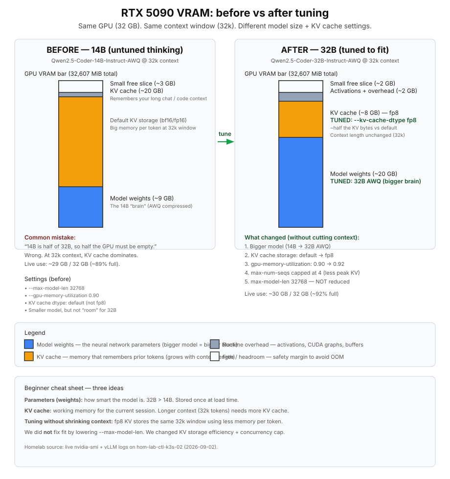

# 5090 vLLM — Qwen2.5-Coder 14B vs 32B AWQ

Operator runbook for the **primary 5090 coding lane** on `hom-lab-ctl-k3s-02`.
Covers two weight classes we evaluated on the same GPU at **32k context**, what we
changed to make **32B** fit without trimming context, and how to re-tune safely.

**LiteLLM client id:** `qwen2.5-coder-32b@k3s02-vllm`  
**Catalog lane:** `code-review` (`inventory/group_vars/model_catalog/manifest.yml`)

## Visual — VRAM before & after



Remedial walkthrough (same diagram, more prose):
[plan diagrams/5090-vram-tuning-before-after.md](../../plans/2026-09-01--homelab-local-ai-clients-cursor-kilo/diagrams/5090-vram-tuning-before-after.md)

## The two models

| | **14B AWQ (rejected)** | **32B AWQ (selected)** |
| --- | --- | --- |
| HF weights | `Qwen/Qwen2.5-Coder-14B-Instruct-AWQ` | `Qwen/Qwen2.5-Coder-32B-Instruct-AWQ` |
| Client id (example) | `qwen2.5-coder-14b@k3s02-vllm` | `qwen2.5-coder-32b@k3s02-vllm` |
| Parameter class | Smaller coder | Primary 5090 coder |
| VRAM @ 32k (measured) | **~29 GB / 32 GB (~89%)** | **~30 GB / 32 GB (~92%)** |
| Why we stopped here | Undersized for a 32 GB primary lane — VRAM was already full from KV, not “half empty” | Best fit for quality chat / review on 5090 without cutting context |
| Tool calling | Same Qwen2.5 `<tools>` format issue | Fixed with `qwen2_5_coder` parser plugin (see below) |

### Lesson that drove the swap

At **`--max-model-len 32768`**, VRAM is dominated by the **KV cache**, not weight
count alone. A 14B model can still consume ~29 GB because the context window is
large. Moving to 32B is not “double the GPU”; it is trading **smaller weights +
default KV** for **larger weights + fp8 KV** at the **same context ceiling**.

Do **not** infer free VRAM from parameter count on long-context coding lanes.

## Selected 32B tuning (current)

Ansible source of truth: `inventory/host_vars/hom-lab-ctl-k3s-02.yaml`

```yaml
k3s_vllm_runtime_model: Qwen/Qwen2.5-Coder-32B-Instruct-AWQ
k3s_vllm_runtime_enable_auto_tool_choice: true
k3s_vllm_runtime_tool_call_parser: "qwen2_5_coder"
k3s_vllm_runtime_tool_parser_plugin_enabled: true
k3s_vllm_runtime_extra_args:
  - --gpu-memory-utilization
  - "0.92"
  - --max-model-len
  - "32768"
  - --kv-cache-dtype
  - "fp8"
  - --max-num-seqs
  - "4"
```

### What each knob does

| Knob | Value | Intent |
| --- | --- | --- |
| `--max-model-len` | `32768` | **Do not lower** for homelab client contracts (Continue / gateway) unless operator explicitly accepts a context tradeoff |
| `--kv-cache-dtype fp8` | fp8 | Halves KV bytes vs default — **key lever** that let 32B keep 32k |
| `--gpu-memory-utilization` | `0.92` | Lets vLLM allocate a slightly larger KV pool after weights + activations |
| `--max-num-seqs` | `4` | Caps concurrent sequences to limit peak KV without trimming context |
| AWQ weights | 4-bit | ~20 GB class weight footprint for 32B |

### What we did *not* do

- Drop context to 16k/24k to “make it fit”
- Assume 14B left half the 5090 free
- Treat K3s apiserver / disk-pressure evictions as GPU OOM (prior 32B failure correlated with cluster restart, not a confirmed weight OOM)

## Tool calling (TDD path)

Qwen2.5-**Coder** emits tool intent as `<tools>{...}</tools>` in `content`.
vLLM’s documented `hermes` parser expects `<tool_call>` tags — **HTTP 200 but
`tool_calls: null`**.

| Step | Result |
| --- | --- |
| Enable `--enable-auto-tool-choice` only | **HTTP 400** — `tool_choice: auto` rejected |
| Add `--tool-call-parser hermes` | **HTTP 200**, tool JSON still in `content` |
| Add `--tool-call-parser qwen3_xml` | Same — still in `content` |
| Add community **`qwen2_5_coder`** plugin (`roles/k3s_vllm_runtime/files/qwen2_5_coder_tool_parser.py`) | **PASS** — `finish_reason: tool_calls`, `read_file` args parsed |

Probe evidence (2026-09-02): `read_file` on `/etc/hosts` returned structured
`tool_calls` with `{"path": "/etc/hosts"}`.

**Agent lanes** (OpenCode default, Kilo code agent) should use a lane with proven
`tool_calls` until 32B parser regression tests pass in CI/playbooks.

## Apply / verify / undo

| | Command / surface |
| --- | --- |
| **Apply vLLM** | `ansible-playbook playbooks/deploy_vllm_runtime.yaml -i inventory/inventory.yaml --limit hom-lab-ctl-k3s-02` |
| **Apply gateway** | `ansible-playbook playbooks/deploy_litellm_gateway.yaml -i inventory/inventory.yaml --limit hom-lab-ctl-k3s-02` |
| **Verify chat** | `curl -s http://litellm.hom.lab/v1/chat/completions` with `model: qwen2.5-coder-32b@k3s02-vllm` |
| **Verify tools** | `playbooks/validate_kilo_litellm_probes.yaml` (32B `tool_calls` assertion) |
| **Verify clients** | `playbooks/validate_homelab_local_clients_probes.yaml` |
| **Undo 32B** | Revert host_vars model + extra_args; redeploy vLLM + gateway |
| **Change class** | Idempotent Ansible; model swap may re-download HF weights |

Live GPU check on k3s-02:

```bash
ssh hom-lab-ctl-k3s-02 'nvidia-smi --query-gpu=memory.used,memory.total --format=csv'
kubectl get pods -n vllm-runtime
```

## Re-tune checklist (use on every research pass)

Copy this block into your PR / plan receipt when changing 5090 vLLM settings.

- [ ] Record **why** (capability, VRAM, latency, tool calling, client contract)
- [ ] Capture **before** `nvidia-smi` and vLLM startup log (weight + KV GiB)
- [ ] List **candidate knobs** with expected effect (see table above)
- [ ] Run **chat** probe — full assistant body, not just HTTP code
- [ ] Run **tool** probe — assert `tool_calls`, not JSON in `content`
- [ ] Update this runbook + diagram if VRAM bars change materially
- [ ] Update `model_catalog/manifest.yml` only when selection gates pass
- [ ] Update `continue_ide_hosts` / client matrices if lane roles change

## Future candidates (not selected)

| Candidate | Blocker |
| --- | --- |
| `Qwen3-Coder-*` on vLLM | Needs `qwen3_coder` parser + VRAM matrix on 5090 |
| `Qwen3.6-27B` Ollama on desktop | Different host/stack — see catalog `qwen3.6-27b` |
| Keep 14B as primary | Rejected — wrong capability class for 32 GB primary lane |

## Related files

| File | Purpose |
| --- | --- |
| `inventory/host_vars/hom-lab-ctl-k3s-02.yaml` | Live vLLM + LiteLLM tuning |
| `roles/k3s_vllm_runtime/` | Deployment role + `qwen2_5_coder` plugin |
| `inventory/group_vars/continue_ide_hosts/main.yml` | Continue research matrix |
| `inventory/group_vars/model_catalog/manifest.yml` | Catalog `code-review` lane |
| HRL | `homelab-reference-library/notes/investigations/2026-09-02--5090-vllm-32b-awq-memory-sizing.md` |
