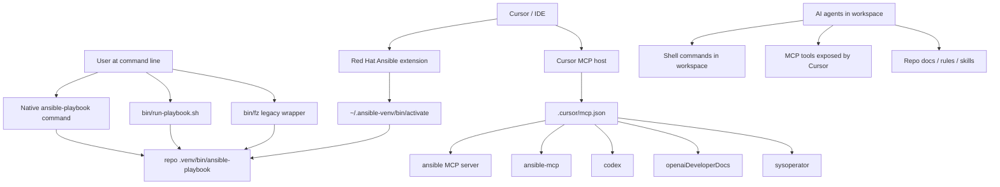
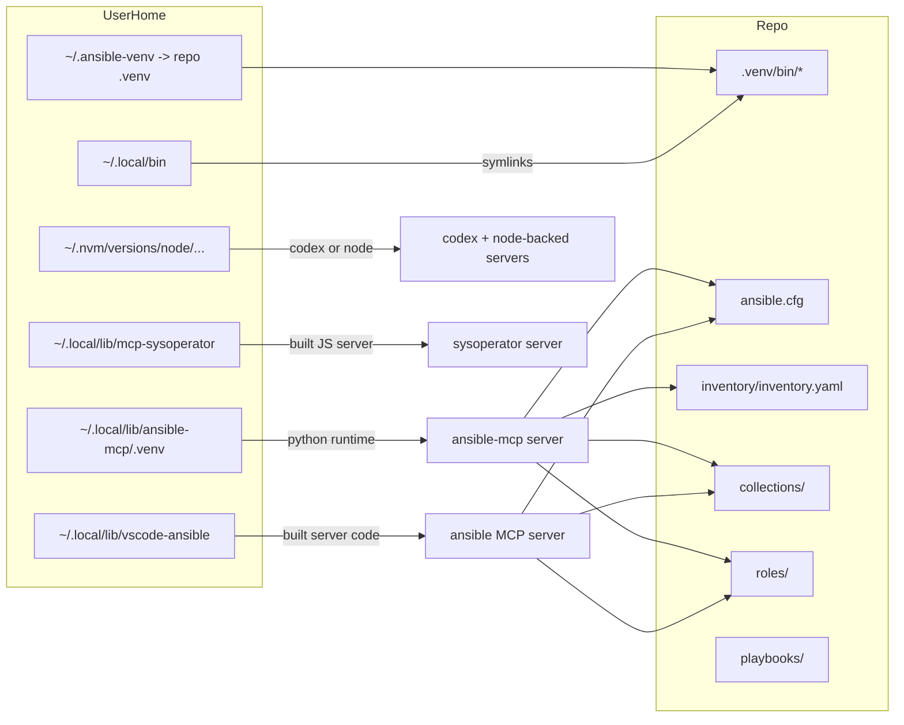

# Tool Access Map

This doc explains how tools are reached from four different surfaces in this
repo:

- command line
- Cursor / IDE features
- Cursor MCP servers
- AI agents working inside this workspace

The goal is to make overlap visible and keep the source of truth clear.

## Key rule

For Ansible on macOS, there should be one effective toolchain:

- source of truth: `repo/.venv/bin/*`
- globally discoverable entrypoints: `~/.local/bin/*` symlinked back to that
  same project venv

MCP servers are different: they often have their own runtimes and should not be
confused with the repo Ansible toolchain.

## Scope Diagram



## Tool Origin Diagram



## Access Paths By Surface

| Surface | What it calls | Immediate entrypoint | True source of tool/runtime | Config source |
|---|---|---|---|---|
| Command line, native | `ansible-playbook` | `.venv/bin/ansible-playbook` or `~/.local/bin/ansible-playbook` | repo `.venv` | playbook command + `inventory/inventory.yaml` |
| Command line, helper | `bin/run-playbook.sh` | hard-pins `repo/.venv/bin/ansible-playbook` | repo `.venv` | `bin/run-playbook.sh` |
| Command line, legacy wrapper | `bin/fz` | wrapper functions | repo `.venv` internally | `scripts/lib.sh` |
| Cursor Ansible extension | `ansible`, `ansible-lint`, ALS subprocesses | `~/.ansible-venv/bin/activate` | repo `.venv` | `.vscode/settings.json` |
| Cursor MCP host: `ansible` | Node process + built MCP server | node from NVM + `~/.local/lib/vscode-ansible/.../cli.js` | built server under `~/.local/lib/vscode-ansible` plus repo paths in env | `.cursor/mcp.json` |
| Cursor MCP host: `ansible-mcp` | Python process | `~/.local/lib/ansible-mcp/.venv/bin/python` | ansible-mcp’s own venv | `.cursor/mcp.json` |
| Cursor MCP host: `codex` | `codex mcp-server` | codex binary under NVM-managed path | Codex install, not repo `.venv` | `.cursor/mcp.json` |
| Cursor MCP host: `openaiDeveloperDocs` | remote MCP URL | HTTPS | OpenAI remote service | `.cursor/mcp.json` |
| Cursor MCP host: `sysoperator` | node + built JS | `node` + `~/.local/lib/mcp-sysoperator/build/index.js` | NVM/system node + built server | `.cursor/mcp.json` |
| AI agent shell actions | shell commands | workspace shell / command runner | usually PATH, which should resolve Ansible via `~/.local/bin` -> repo `.venv` | shell env + repo docs |
| AI agent MCP actions | MCP tool calls | Cursor MCP host | whatever runtime each MCP server owns | `.cursor/mcp.json` |

Repo safety note:
- for repo-local Python-, Ansible-, and WinRM-sensitive work on macOS, prefer
  `bin/codex-env ...` over a separate MCP-owned Python runtime when both can
  answer the same question
- `ansible-mcp` is a separate Python runtime and must be explicitly wrapped or
  environment-hardened if it is expected to behave like the repo shell

## Current source-of-truth files

- IDE Ansible activation: [.vscode/settings.json](/Users/joshc/develop/dotfile-vnext/.vscode/settings.json)
- MCP server definitions: [.cursor/mcp.json](/Users/joshc/develop/dotfile-vnext/.cursor/mcp.json)
- Native-Ansible policy: [docs/ansible/native-ansible-first.md](/Users/joshc/develop/dotfile-vnext/docs/ansible/native-ansible-first.md)
- Ansible toolchain sync note: [docs/ansible/ansible-toolchain-sync.md](/Users/joshc/develop/dotfile-vnext/docs/ansible/ansible-toolchain-sync.md)
- Ansible toolchain convergence role: [roles/ansible_dev_tools/README.md](/Users/joshc/develop/dotfile-vnext/roles/ansible_dev_tools/README.md)

## Practical boundaries

### 1. What should be shared

These should converge to the same Ansible toolchain on macOS:

- direct shell use of `ansible*`
- `bin/run-playbook.sh`
- Cursor Ansible extension
- agent shell actions that rely on `ansible*` from PATH

That shared source of truth is the repo `.venv`, surfaced through:

- `.venv/bin/*`
- `~/.local/bin/*` symlinks
- `~/.ansible-venv`

### 2. What should remain separate

These are intentionally separate runtimes:

- `ansible-mcp` Python venv under `~/.local/lib/ansible-mcp/.venv`
- Red Hat Ansible MCP server build under `~/.local/lib/vscode-ansible`
- Codex binary under NVM-managed Node install
- `mcp-sysoperator` build under `~/.local/lib/mcp-sysoperator`
- remote `openaiDeveloperDocs` HTTP MCP

They may point at repo config and paths, but they are not the repo Ansible venv.

### 3. Where confusion usually comes from

Most confusion comes from mixing:

- tool *visibility* on PATH
- tool *origin*
- tool *runtime*

Example:

- `ansible-playbook` on PATH may look global
- but on this machine it should resolve through `~/.local/bin/ansible-playbook`
- which is just a symlink back to the repo `.venv`

That is still one toolchain, not two.

## Preferred commands

Preferred for direct repo Ansible runs:

```bash
.venv/bin/ansible-playbook <playbook> -i inventory/inventory.yaml ...
```

Also acceptable when the symlinks are in sync:

```bash
ansible-playbook <playbook> -i inventory/inventory.yaml ...
```

Preferred helper when you want run logging and inventory snapshot behavior:

```bash
./bin/run-playbook.sh <playbook> [args]
```

De-emphasized:

```bash
./bin/fz role-local ...
./bin/fz deploy ...
```
