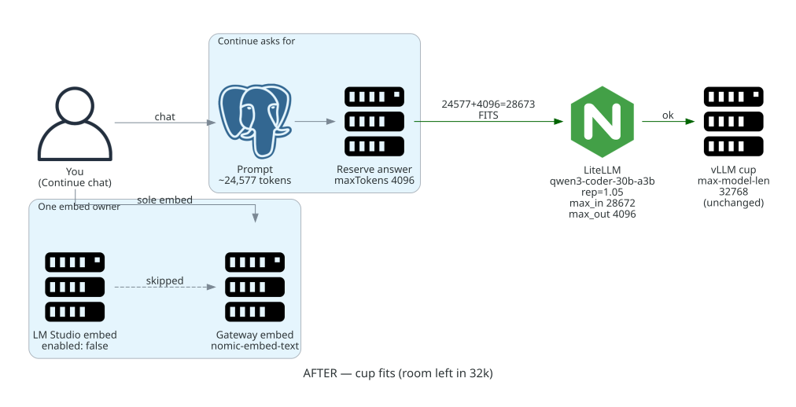

# After — what changed and why it fixes it

Same **32,768 cup**. Continue still sends a big prompt, but now only reserves
**4,096** for the answer. ~24,577 + 4,096 stays **under** the rim, so LiteLLM
lets the request through.

Embeddings: **one owner** — Continue keeps only gateway `nomic-embed-text` on
`roles: [embed]`. LM Studio `continue-nomic-embed` is `enabled: false` (still
in inventory for deliberate compares, not active). That replaces the earlier
hand-comment-out.

Gateway also got explicit cup teaching (`max_input` / `max_output`) and HF’s
`repetition_penalty: 1.05`. The model weight on vLLM did **not** need swapping.

Kid pictures (same story, separate metaphors):

- Cup fits → [`metaphor/02-after-cup-fits.png`](metaphor/02-after-cup-fits.png)
- One teacher → [`metaphor/04-after-one-teacher.png`](metaphor/04-after-one-teacher.png)

**Values that matter now:**

| Surface | After |
| --- | --- |
| **vLLM** | Still **32768** (unchanged) |
| **Continue chat** | `maxTokens` **4096** — leaves headroom under the cup |
| **Continue embed** | Sole active: gateway `nomic-embed-text`; LM Studio `enabled: false` |
| **Gateway (optional teaching)** | `max_input` 28672 / `max_output` 4096 · rep **1.05** |
