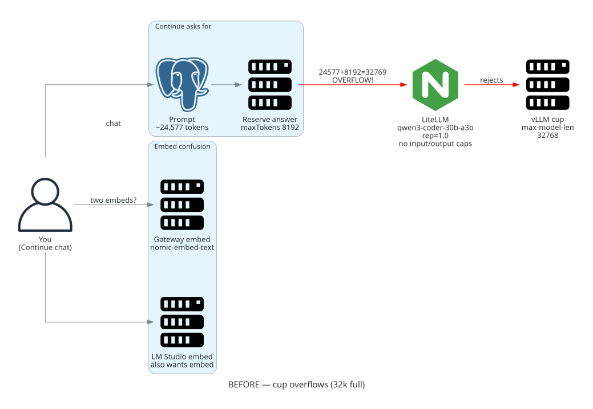

# Before — what you were looking at

## Chat cup (context overflow)

Picture a **cup that holds 32,768 tokens**. That cup is vLLM (`max-model-len`).

Continue poured in a big prompt (~24,577) and also reserved a huge sip for the
answer (`maxTokens: 8192`). Together that was **32,769** — one drop over the
rim. The request was rejected (`ContextWindowExceededError`).

## Embed inventory (not a race condition)

“In the race” here meant **two candidates competing for the same job**, not a
concurrency / race-condition bug.

What we saw technically:

- Continue’s managed config listed **two** models with `roles: [embed]`:
  - Gateway: `nomic-embed-text` → `http://litellm.hom.lab`
  - Local: `continue-nomic-embed` → LM Studio `http://127.0.0.1:1234/v1`
- Neither entry was broken by itself. The problem was **duplicate ownership**:
  inventory did not declare a single intended embed owner.
- During evaluation, the operator **manually commented out** the LM Studio
  block in `~/.continue/config.yaml` so only the gateway entry stayed active.
  That hand-edit was evidence the desired state was unclear — not a setting
  Ansible had already enforced.

So embeddings did not “fail to start.” They caused **evaluation / ownership
confusion**: which surface was Continue actually using for embed, and was the
local one supposed to be on?

Kid pictures (same story, separate metaphors):

- Cup spill → [`metaphor/01-before-cup-overflow.png`](metaphor/01-before-cup-overflow.png)
- Two teachers → [`metaphor/03-before-two-teachers.png`](metaphor/03-before-two-teachers.png)

**Values that mattered (before):**

| Surface | What we saw |
| --- | --- |
| **vLLM** | Cup size `max-model-len` **32768** (fine; not the bug) |
| **Continue chat** | `maxTokens` **8192** — too large once input was ~24,577; **Continue** needed a smaller answer reserve so `input + maxTokens ≤ 32768` |
| **Continue embed** | Two entries both claimed `embed` (gateway Nomic + LM Studio). No sole-owner setting yet; local stayed present until hand-commented |

Caps that were missing on the **client** side: Continue’s chat `maxTokens` /
output budget. (Gateway budget teaching came later; it is not listed above.)
