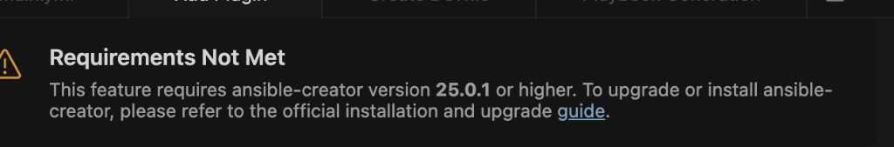
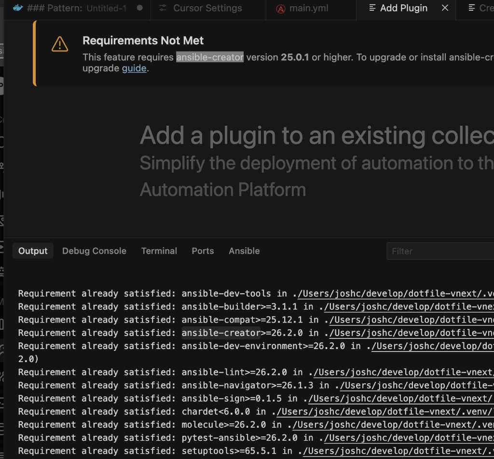

# ansible_dev_tools

Installs Ansible development CLI tooling for the project. **This role must be run on any machine where this project will be developed** — it is the single setup step that makes the Cursor extension and MCP server work correctly.

## Project Developer Setup — Run This First

Before using the Cursor Ansible extension or the ansible MCP server on a new machine, run this role. It:

1. Installs `oniguruma` (system C library required by ansible-navigator)
2. Installs all Ansible dev tools into the project `.venv` via pip
3. Creates `~/.ansible-venv` → symlink pointing to the project venv

The `~/.ansible-venv` symlink is what the Cursor extension uses via `ansible.python.activationScript`
(configured in `.vscode/settings.json`). Without the symlink, the extension cannot activate the
venv and will fail to find `ansible-lint` and other tools.

**Why the symlink instead of a direct path?**
The Ansible extension does not resolve `${workspaceFolder}` in `activationScript` before passing
it to the shell — it is a bug in the extension (the setting skips `interpreterPathResolver.ts`).
An absolute path is required. The symlink at `~/.ansible-venv` provides an absolute path that
works on any machine where this dotfile project is checked out, without hardcoding the checkout path
into committed settings.

See `.vscode/settings.json` for the active configuration and the comment explaining the bug.
See `roles/mcp_servers/redhat-ansible/README.md` for the MCP server's separate tool visibility gap.

## Tools Installed

The `ansible-dev-tools` meta-package installs the following binaries into `.venv/bin/`:

| Binary | Source | Notes |
|---|---|---|
| `ansible` | ansible-core | Core CLI |
| `ansible-builder` | ansible-builder | EE image builder |
| `ansible-community` | ansible-core | Community info |
| `ansible-config` | ansible-core | Config inspection |
| `ansible-console` | ansible-core | Interactive REPL |
| `ansible-creator` | ansible-creator | Role/collection scaffolding |
| `ansible-doc` | ansible-core | Module docs |
| `ansible-galaxy` | ansible-core | Collection/role install |
| `ansible-inventory` | ansible-core | Inventory inspection |
| `ansible-lint` | ansible-lint | Lint and style checks |
| `ansible-navigator` | ansible-navigator | TUI runner |
| `ansible-playbook` | ansible-core | Playbook runner |
| `ansible-pull` | ansible-core | Pull-mode execution |
| `ansible-runner` | ansible-runner | Execution environment runner |
| `ansible-sign` | ansible-sign | Content signing |
| `ansible-test` | ansible-core | Collection testing |
| `ansible-vault` | ansible-core | Secret encryption |
| `ade` | ansible-dev-environment | Dev environment CLI |
| `adt` | ansible-dev-tools | ADT meta CLI |
| `molecule` | molecule | Role testing framework |
| `pytest` / `py.test` | pytest-ansible | Test runner |
| `tox` | tox-ansible | Multi-env test runner |
| `bindep` | bindep | Binary dependency checker |
| `yamllint` | yamllint | YAML linter |
| `black` / `blackd` | black | Python formatter |
| `chardetect` | chardet | Encoding detector |
| `jsonschema` | jsonschema | JSON schema validator |
| `normalizer` | charset-normalizer | Charset normalizer |

The above reflects the actual `.venv/bin/` contents on macOS (Python 3.14, `ansible-dev-tools` 26.2.0).

The table below describes the install method per platform for the three primary tool groups:

| Tool group         | macOS (pip into .venv) | Ubuntu (pipx) | Windows (pip) |
|--------------------|------------------------|---------------|---------------|
| ansible-dev-tools  | pip                    | pipx          | pip           |
| ansible (core)     | pipx `--include-deps`  | pipx          | pip           |
| ansible-lint       | pipx                   | pipx          | -             |

On macOS, tools that cannot compile natively (e.g. `ansible-navigator`) are
provided as Docker wrapper functions deployed to `~/.bashrc.d/`.

## venv Installation (All Tools)

All tools are also installable directly into the project venv as an alternative
to pipx. This is the preferred approach if you want a single venv that the
Cursor extension can point to for all tooling.

Dry-run verified against Python 3.14 venv (no conflicts):

```
ansible-navigator   26.1.3
ansible-builder     3.1.1
ansible-lint        26.3.0
ansible-dev-tools   26.2.0  (meta-package: pulls in navigator, builder,
                             lint, molecule, tox-ansible, pytest-ansible)
```

`ansible-dev-tools` is the Red Hat meta-package. Installing it installs
everything above in one step. `community-ansible-dev-tools` does not exist
on PyPI — it is not a real package name.

To install into the venv:

```bash
pip install ansible-navigator ansible-builder ansible-lint ansible-dev-tools
```

Or via the meta-package alone (installs all of the above):

```bash
pip install ansible-dev-tools
```

## Cursor Extension Configuration (redhat.ansible)

The `redhat.ansible` Cursor extension (v26.1.3) bundles its own
`ansible-language-server` at `out/server/src/server.js`. No separate npm
install of `@ansible/ansible-language-server` is required or used.

**Evidence:** `package.json` in the extension uses `"@ansible/ansible-language-server": "workspace:^"` —
a monorepo build-time reference (pnpm workspace protocol). The ALS TypeScript
source is compiled into the extension during the build. It is not a runtime
npm dependency.

The language server reads its toolchain paths from Cursor settings via the
`ansible` configuration section. This is defined in the ALS source at
`packages/ansible-language-server/src/services/settingsManager.ts`.
If a setting is blank or missing, the language server falls back to PATH.
On this machine, `ansible` and `ansible-playbook` are inside the project
venv and are not on the system PATH when Cursor launches — so without
explicit path configuration, all language features (autocomplete, validation,
hover docs, go-to-definition) are silently non-functional.

### Known Workaround — `.envrc` venv activation

The `${workspaceFolder}` variable fails to resolve in the shell command context
the extension uses to activate the venv (see Known Gap section below). As a
workaround, add the following line to `.envrc` in the project root:

```bash
source /Users/joshc/develop/dotfile-vnext/.venv/bin/activate
```

This makes the venv tools visible to the Ansible extension by activating the
venv in any shell Cursor opens in the workspace. The extension then picks up
`ansible-lint` from `.venv/bin/` even though `activationScript` is not
resolving correctly.

> The symlink alternative (`ln -s /Users/joshc/develop/dotfile-vnext/.venv ~/.ansible-venv`
> then setting `activationScript` to `/Users/joshc/.ansible-venv/bin/activate`) was
> considered but the `.envrc` approach was chosen as it requires no extra filesystem
> state outside the project.

### Current Path Configuration — Manually Set, Under Test

> **Note:** The toolchain paths below are currently configured by hand in
> `.vscode/settings.json` (project-level) while we validate that the venv
> approach works end-to-end with the Cursor language server. Once confirmed,
> the `ansible_dev_tools` role will manage these settings automatically.
> Node, Python, and all tool paths are explicitly specified — nothing relies
> on system PATH.

The project-level settings file at `.vscode/settings.json` contains:

```json
"ansible.python.activationScript": "${workspaceFolder}/.venv/bin/activate",
"ansible.ansible.path":            "${workspaceFolder}/.venv/bin/ansible",
"ansible.validation.lint.path":    "${workspaceFolder}/.venv/bin/ansible-lint"
```

The user-level fallback (`~/Library/Application Support/Cursor/User/settings.json`)
contains the same paths using absolute values in case the workspace-relative
form is not resolved in a particular Cursor context.

**`ansible.python.activationScript`** — sourced by bash before every ansible
command the language server runs. When set, `ansible.python.interpreterPath`
is ignored (per ALS `settingsManager.ts` description). This is the correct
pattern for venv-based installations: no global Python or ansible needed.

**`ansible.ansible.path`** — path to the `ansible` binary. The ALS default
is the string `"ansible"` (PATH lookup). Must be set explicitly when ansible
lives inside a venv.

**`ansible.validation.lint.path`** — path to `ansible-lint`. Default is
`"ansible-lint"` (PATH lookup). Currently installed at `~/.local/bin/ansible-lint`
via pipx. If ansible-lint is moved into the venv, update this to
`/Users/joshc/develop/dotfile-vnext/.venv/bin/ansible-lint`.

### Portable Alternative (workspace-relative)

The path resolver in the extension (`src/features/utils/interpreterPathResolver.ts`)
supports `${workspaceFolder}` as a variable. This makes settings portable
across machines where the project is checked out to different paths:

```json
"ansible.python.activationScript": "${workspaceFolder}/.venv/bin/activate",
"ansible.ansible.path":            "${workspaceFolder}/.venv/bin/ansible",
"ansible.validation.lint.path":    "~/.local/bin/ansible-lint"
```

This project currently uses the absolute path option above.

## Known Gap — Language Server Cannot Resolve `${workspaceFolder}`

**Status: RESOLVED — 2026-03-12**
**Fix:** Set `ansible.python.activationScript` to an absolute path via the `~/.ansible-venv` symlink.
See `.vscode/settings.json` — the active setting and the explanation of why `${workspaceFolder}` cannot be used.

---

**Original issue documented below for reference.**

### What is happening

The Ansible extension (`redhat.ansible`) does not expand `${workspaceFolder}` before
passing paths to the shell. The variable is sent as a literal string, so the shell
receives a path with the workspace component stripped entirely:

```
# What the extension sends to the shell:
sh -c '. ${workspaceFolder}/.venv/bin/activate && command -v ${workspaceFolder}/.venv/bin/ansible-lint'

# What the shell actually tries to resolve:
sh: /.venv/bin/activate: No such file or directory
```

The workspace folder is gone. The shell sees `/.venv/bin/activate` — an absolute path
rooted at `/`. No file exists there, so every tool check the extension runs fails.

### Downstream symptom: "Requirements Not Met" banner

The "Requirements Not Met — ansible-creator version 25.0.1 required" banner that appears
in the extension UI is a **downstream consequence** of the venv activation failure, not a
separate issue. `ansible-creator 26.3.0` is installed in the venv and works correctly from
the terminal. The extension cannot find it because it never successfully activated the venv.





### Evidence

Extension output panel (`redhat.ansible` → Output → Ansible Support):

```
cmd 'ansible-lint --version' was not executed with the following error:
Command failed: sh -c '. ${workspaceFolder}/.venv/bin/activate && ${workspaceFolder}/.venv/bin/ansible-lint --version'
sh: /.venv/bin/activate: No such file or directory

Error: Command failed: sh -c '. ${workspaceFolder}/.venv/bin/activate && command -v ${workspaceFolder}/.venv/bin/ansible-lint'
sh: /.venv/bin/activate: No such file or directory
```

Terminal confirms tools are present and functional:

```
(.venv) $ ansible-creator --version
26.3.0
(.venv) $ ls .venv/bin/ansible*
ansible  ansible-builder  ansible-config  ansible-console  ansible-creator
ansible-doc  ansible-galaxy  ansible-inventory  ansible-lint  ansible-navigator
ansible-playbook  ansible-pull  ansible-runner  ansible-sign  ansible-test  ansible-vault
```

### What has been tried

| Approach | Result |
|---|---|
| `${workspaceFolder}/.venv/bin/activate` in `.vscode/settings.json` | Fails — variable not expanded by ALS |
| Absolute path in user-level settings (`~/Library/Application Support/Cursor/User/settings.json`) | Works from CLI; extension still fails at runtime |

### What has NOT been investigated

- Whether Cursor's **multi-root workspace** mode vs. **single-folder** mode changes how
  `${workspaceFolder}` is resolved by the extension host
- Whether a newer release of `redhat.ansible` fixes the variable substitution
- Whether the `ansible.python.interpreterPath` setting (pointing directly at
  `.venv/bin/python`) bypasses the activation script problem entirely

### Current state

- `.vscode/settings.json` is configured manually with `${workspaceFolder}`-relative paths
- The `ansible_dev_tools` role does **not** yet manage `.vscode/settings.json`
- That automation is deferred until this gap is understood and resolved
- Do not attempt to "fix" these paths by switching to absolute paths in the project file —
  that breaks portability. The correct fix is to understand why the variable is not resolved.

---

## Dependencies

- `common/shell_config` — ensures `~/.bashrc.d` sourcing pattern exists
- `python` — provides pip/pipx

## MCP Server

The Red Hat Ansible Cursor extension MCP server configuration has moved to
`roles/mcp_servers/redhat-ansible`. See that role's README for extension path
detection, environment variables, and version management.
