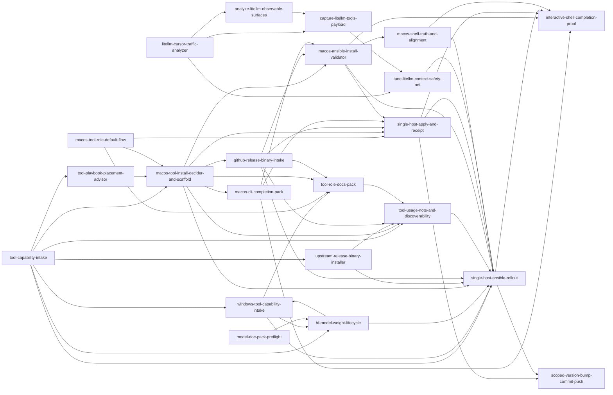

# Skills Library

Reusable project-skill workflows for `dotfile-vnext`.

This library adopts the current project-skill pattern used in
`/Users/joshc/develop/homelab-reference-library/skills` and is the design
authority for new project skills in this repo.

Runtime-discovery skills still live under `.cursor/skills/`. When a workflow
needs to become a reusable project skill, design it here first and mirror it to
runtime-discovery surfaces only when that extra step is needed.

## How agents should use this library

1. Open `skills/catalog.yaml` and match on `description` and `triggers`.
2. Load only the matching skill `SKILL.md`.
3. Follow the `Progressive disclosure` lines before reading `references/`.
4. Prefer a skill with `default_for` when the request matches a known default flow.
5. Hand off with `handoff_to` or `recommended_sequence` instead of inventing a sibling workflow.

## Categories

| Category | Role |
| --- | --- |
| `documentation` | Metadata, README, and managed usage-note workflows |
| `implementation` | Capability intake and installer design workflows |
| `validation` | Preview, apply, verify, and evidence-capture workflows |

## Handoff graph

## Pack index

| Skill | Category | Handoff |
| --- | --- | --- |
| `tool-capability-intake` | implementation | intake router for repo tool capabilities |
| `tool-playbook-placement-advisor` | implementation | choose the owning playbook and role lane before tool implementation |
| `windows-tool-capability-intake` | implementation | Windows/HVH tool present\|absent intake |
| `hf-model-weight-lifecycle` | implementation | HF weight trees on share; download ≠ serve |
| `macos-tool-role-default-flow` | implementation | Josh default entrypoint for macOS tool install + docs + single-host receipt |
| `macos-tool-install-decider-and-scaffold` | implementation | choose install family early, then scaffold |
| `macos-cli-completion-pack` | implementation | standardize managed Bash completion wiring for macOS CLIs |
| `upstream-release-binary-installer` | implementation | install-path design, then rollout |
| `github-release-binary-intake` | implementation | GitHub release asset, checksum, and arch intake |
| `project-skill-runtime-bridge` | implementation | symlink project skills into runtime discovery |
| `scoped-version-bump-commit-push` | implementation | scoped version bump, focused commit, and push closeout |
| `tune-litellm-context-safety-net` | implementation | trim/fallback drivers, then rollout |
| `tool-role-docs-pack` | documentation | standard docs-pack entrypoint for tool roles |
| `tool-usage-note-and-discoverability` | documentation | metadata, docs pack, and usage guidance |
| `macos-ansible-install-validator` | validation | macOS archive/check-mode/install validation |
| `single-host-apply-and-receipt` | validation | one-host preview/apply/verify with receipt |
| `single-host-ansible-rollout` | validation | preview/apply/verify evidence and receipt |
| `macos-shell-truth-and-alignment` | validation | collect shell truth, classify drift, and route to repo-owned alignment |
| `interactive-shell-completion-proof` | validation | real PTY proof for tab completion and shell-time behavior |
| `litellm-cursor-traffic-analyzer` | validation | Cursor→LiteLLM diagnosis router |
| `capture-litellm-tools-payload` | validation | dump/measure client `tools[]` via LiteLLM gateway |
| `analyze-litellm-observable-surfaces` | validation | inventory what LiteLLM can report |

## Shared assets

- `_shared/human-escalation.md` — stop points for hidden-risk decisions
- `_shared/verification-receipt-template.md` — lightweight rollout receipt
- `_template/` — starter for future skills
- `evals/` — trigger examples for future validation and tuning

## Repo wrappers

For repo-local Python and Ansible work, use `bin/codex-env` instead of ambient
interpreters or PATH assumptions. This matches `AGENTS.md`.
